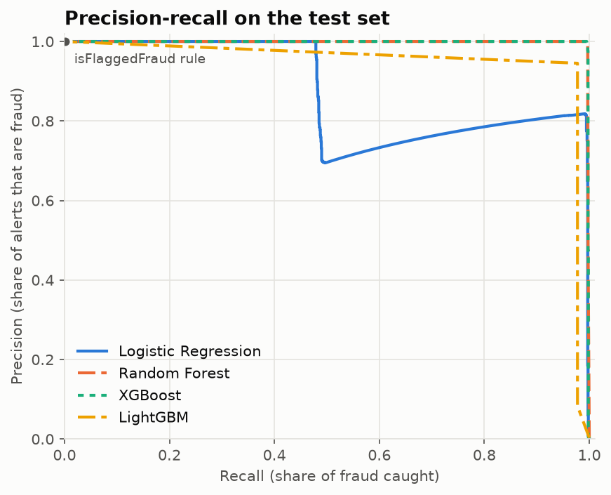
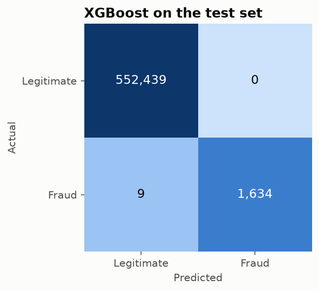
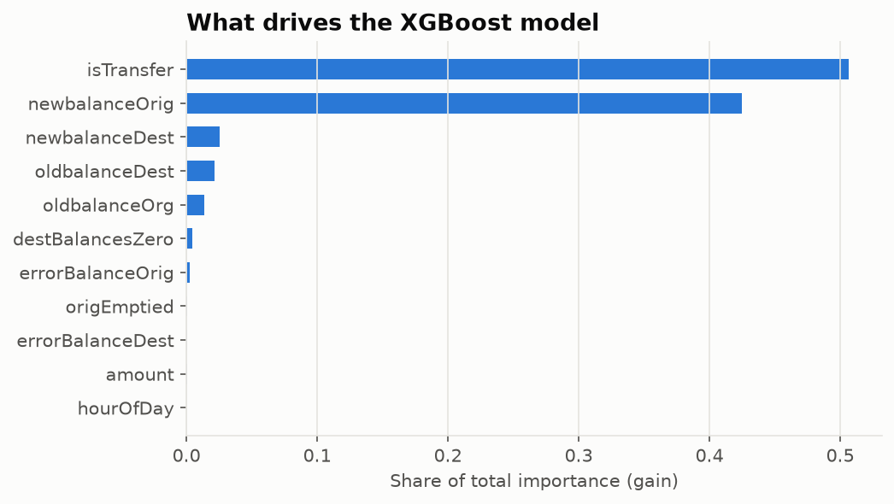
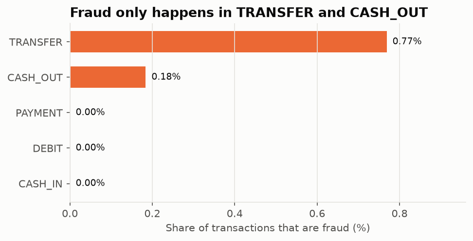
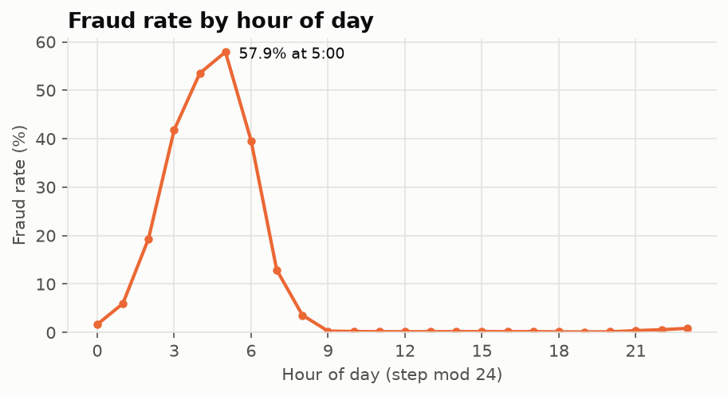

# Fraud Detection in Mobile-Money Transactions

[](https://github.com/CS-Shahad/Fraud_Detection_Model/actions/workflows/tests.yml)
[](https://colab.research.google.com/github/CS-Shahad/Fraud_Detection_Model/blob/main/notebooks/fraud_detection.ipynb)


A machine-learning pipeline that detects fraudulent transactions among **6.3 million** mobile-money
transactions, where only **0.13%** are fraud. It compares Logistic Regression, Random Forest, XGBoost and
LightGBM against the rule-based system already in the data.

## Highlights

- **Evaluation built for imbalanced data.** Models are judged on PR-AUC, precision, recall and the share of
  stolen money recovered, not on accuracy, which is 99.87% even for a model that never flags anything.
- **No test-set leakage.** A stratified 60/20/20 train/validation/test split. Decision thresholds and the
  final model are chosen on validation, and the test set is used once.
- **Domain-driven analysis.** Fraud in this data only occurs in two transaction types and shows up in how
  account balances change. The pipeline filters and engineers features around that.
- **Reusable code, not only a notebook.** A small Python package with a command-line training script, a
  scorer for new transactions, unit tests and CI.

## Results

<!-- RESULTS -->
On a held-out test set of **554,082** TRANSFER and CASH_OUT transactions (1,643 of them fraud):

| Model | PR-AUC | Precision | Recall | Fraud caught | Stolen money caught | False alarms |
|---|---:|---:|---:|---:|---:|---:|
| **XGBoost** (selected) | **0.998** | **100.0%** | 99.5% | 1,634 / 1,643 | 99.9% | **0** |
| Random Forest | 0.997 | 99.9% | 99.7% | 1,638 / 1,643 | 99.9% | 1 |
| LightGBM | 0.924 | 94.5% | 97.8% | 1,606 / 1,643 | 98.6% | 93 |
| Logistic Regression | 0.877 | 81.8% | 99.2% | 1,630 / 1,643 | 99.5% | 364 |
| Existing rule (`isFlaggedFraud`) | 0.005 | 100.0% | 0.2% | 3 / 1,643 | 0.5% | 0 |

- **XGBoost catches 99.5% of fraud with zero false alarms**, while the rule already in the data catches
  3 cases. It was selected on validation PR-AUC. Random Forest is effectively tied.
- **Compared with the original version of this project**, where the best model (Random Forest) reached
  98% precision and 80% recall, recall rose to 99.5% and false alarms fell to zero. The test splits differ,
  so the comparison is indicative.
- Logistic regression also catches over 99% of fraud, but at the cost of hundreds of false alarms.

<p align="center">
  
  
</p>

**What the model relies on.** Mostly the transaction type and the sender's balance after the transaction,
since fraud typically drains the sender's account to zero. The engineered balance-error features add
little on top: a tree model can learn the same splits straight from the raw balances.

<p align="center">
  
</p>

Full numbers: [`reports/model_comparison.md`](reports/model_comparison.md) and
[`reports/metrics.json`](reports/metrics.json).
<!-- /RESULTS -->

## Approach

**1. Explore.** All fraud occurs in `TRANSFER` and `CASH_OUT` transactions, which fits the fraud scenario
the simulator models: take over an account, transfer the funds to a mule account, and cash out. The other
three types are labelled legitimate by rule, so over half of the rows never reach the model. Fraud is also
concentrated in time: between 3:00 and 6:00, roughly 40–58% of transactions are fraud, against almost
none during the day. Fraudulent amounts are larger, with a median of about 441k against 171k.

<p align="center">
  
  
</p>

**2. Engineer features.**

| Feature | Idea |
|---|---|
| `errorBalanceOrig`, `errorBalanceDest` | Gap between the recorded balances and what the amount implies |
| `origEmptied` | The sender's account was drained to exactly zero |
| `destBalancesZero` | Money arrived, yet the receiver shows a zero balance before and after |
| `isTransfer`, `hourOfDay` | Transaction type and time of day |

**3. Train and tune.** Each model is fit on the training set. Its decision threshold is then set on the
validation set to maximise F1. Class imbalance is handled through the threshold rather than
oversampling, which keeps the predicted probabilities meaningful.

**4. Evaluate once** on the untouched test set, against the `isFlaggedFraud` rule as the baseline.

## Project structure

```
├── notebooks/
│   └── fraud_detection.ipynb   # the full analysis, with charts and commentary
├── src/fraud_detection/
│   ├── data.py                 # loading (with Kaggle download) and stratified splitting
│   ├── features.py             # feature engineering
│   ├── models.py               # the candidate models
│   ├── evaluation.py           # PR-AUC, threshold tuning, fraud amount caught
│   ├── plots.py                # charts
│   ├── train.py                # end-to-end training CLI
│   └── predict.py              # FraudScorer: score new transactions
├── tests/                      # unit and pipeline tests (pytest)
├── reports/                    # metrics and figures from the latest run
└── data/                       # dataset goes here (not committed)
```

## Run it

**Get the data first.** Download the CSV from [Kaggle](https://www.kaggle.com/datasets/ealtaf/paysim1)
and put it (or the zip) in `data/`. Alternatively, set a Kaggle API token (`KAGGLE_API_TOKEN`) and the code
downloads it for you. See [`data/README.md`](data/README.md).

**In the browser:** click *Open in Colab* above, point `DATA_PATH` at your copy of the CSV, and run all
cells.

**In GitHub Codespaces:** *Code → Codespaces → Create codespace*. Dependencies install automatically.
Drag the dataset into `data/`, then run `python -m fraud_detection.train` in the terminal.

**Locally:**

```bash
git clone https://github.com/CS-Shahad/Fraud_Detection_Model.git
cd Fraud_Detection_Model
python -m venv .venv && source .venv/bin/activate
pip install -e ".[dev]"

python -m fraud_detection.train              # full run: trains, writes reports/ and models/
python -m fraud_detection.train --sample 0.1 # quick run on 10% of the data
pytest                                       # tests
```

**Score new transactions:**

```python
import pandas as pd
from fraud_detection.predict import FraudScorer

scorer = FraudScorer()  # loads models/fraud_model.joblib
scorer.score(pd.read_csv("new_transactions.csv"))  # -> fraud_probability, is_fraud_alert
```

## Limitations and next steps

- **Simulated data.** PaySim imitates real mobile-money logs, but its balance signal is much cleaner than
  in real transactions. The near-perfect scores reflect the simulator, and real-world performance would be
  lower.
- **Timing.** The features use balances *after* the transaction, so the model detects fraud just after it
  happens rather than blocking it before authorisation.
- **Next:** tune LightGBM, measure each engineered feature's contribution, validate on a time-based split, choose the threshold from a business cost model, add
  per-account behaviour features, explain predictions with SHAP, and serve the scorer through an API.

## Dataset

[PaySim on Kaggle](https://www.kaggle.com/datasets/ealtaf/paysim1). E. A. Lopez-Rojas, A. Elmir and
S. Axelsson, *PaySim: A financial mobile money simulator for fraud detection*, EMSS 2016.
